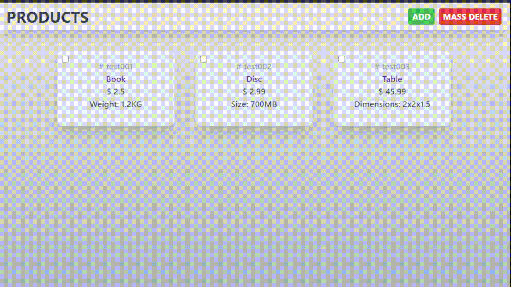
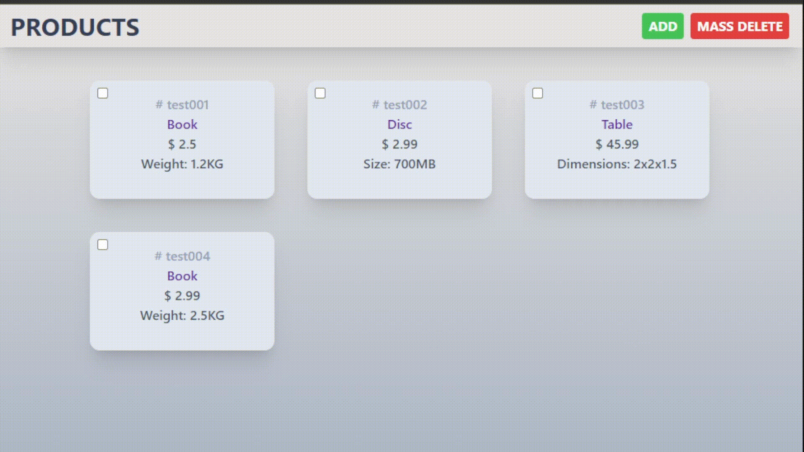

# <p align="center">Products page</p>
<p align="center">
<a href="https://www.php.net/"></a>
<a href="https://www.mysql.com/"></a>
</p>

### About:

This is a simple products page with CRUD functionality and is based on the MVC pattern. <br>

Add new products by entering #sku, #name, #price and #type. <br>
Based on the type of the product, additional fields will be displayed. <br>

[Products page](https://products-akermanis.000webhostapp.com/) <- here you can see the live version of the project. <br>

### Preview:

Add new products: <br>


Mass delete selected products: <br>



### Installation:

1. Clone or Download the project.
2. Run:
````
composer install
````
3. Navigate to `/public` directory:
````php
cd .\public\
````
4. Start a server from the terminal
```php
php -S localhost:8000
```


5. Navigate to http://localhost:8000 to see the site.